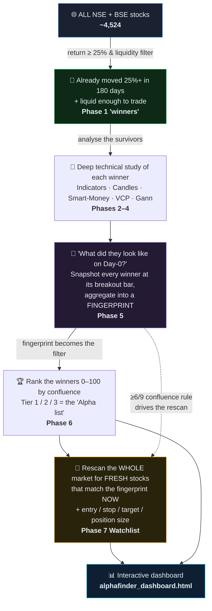
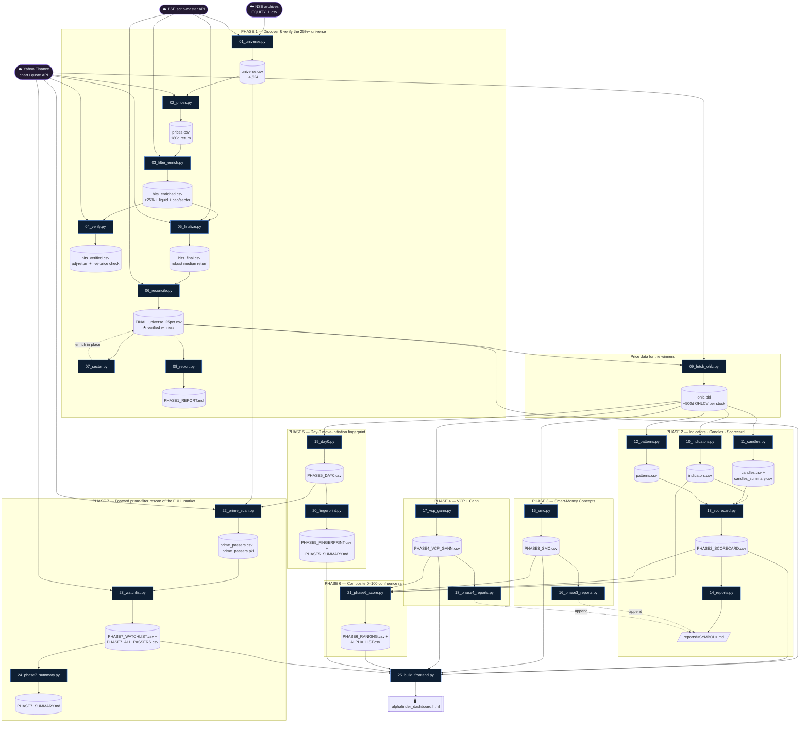

# AlphaFinder — Code & Business Flow

> **One-page mental model for a new developer.**
> AlphaFinder is a **7-phase pipeline** that scans the *entire* NSE + BSE stock universe (~4,500 stocks),
> finds names that already ran up 25%+ in 180 days, studies *what their charts looked like*, distills that
> into a repeatable **"move-initiation fingerprint"**, then rescans the whole market for **fresh** stocks
> that match the fingerprint *before* they run — ending in a risk-defined **watchlist** and an interactive
> **HTML dashboard**.
>
> Each numbered script (`01`…`25`) is **one step**. A step **reads files** produced by earlier steps and
> **writes new files** for later steps. There is no hidden state — every hand-off is a CSV / pickle on disk.
> Run them in numeric order.

---

## 1. Business flow (plain English)



**The core idea (why it is built this way):**
Phases 1–6 are *backward-looking* — they study stocks that **already** won, to learn the recipe.
Phase 7 is *forward-looking* — it applies that recipe to the **whole market** to catch the **next** winners
early. The dashboard is just a viewer over the files those phases produce.

---

## 2. Code & data flow (what each script reads and writes)

> Read top-to-bottom. **Blue = code (a `.py` step)**, **grey = data file on disk**.
> External clouds = live internet sources fetched at runtime.



---

## 3. Shared helper libraries (no `__main__`, imported by the phase scripts)

| Library | What it provides | Used by |
|---|---|---|
| [ta_lib_local.py](ta_lib_local.py) | Pure-pandas indicator math — RSI, Stochastic, MACD, Bollinger, EMA, ADX, ATR, Supertrend, CCI, MFI, OBV, Williams %R, swing detection | `10`, `19`, `22`, `23` |
| [ta_smc.py](ta_smc.py) | Smart-Money Concepts — demand/supply zones, order blocks, fair-value gaps, BoS/CHoCH market structure, premium/discount | `15`, `22`, `23` |
| [ta_vcp_gann.py](ta_vcp_gann.py) | Volatility-Contraction-Pattern detection + Gann angles, Square-of-9 targets, time cycles, octaves | `17`, `22`, `23` |

---

## 4. Quick reference — one line per step

| # | Script | Reads | Writes | Business purpose |
|---|---|---|---|---|
| 01 | `01_universe.py` | NSE + BSE (live) | `universe.csv` | Build the full tradeable equity list (dedupe NSE/BSE by ISIN) |
| 02 | `02_prices.py` | `universe.csv`, Yahoo | `prices.csv` | 180-day return + liquidity per stock |
| 03 | `03_filter_enrich.py` | `prices.csv`, BSE | `hits_enriched.csv` | Keep ≥25% & liquid; add market-cap + sector |
| 04 | `04_verify.py` | `hits_enriched.csv`, Yahoo/NSE/BSE | `hits_verified.csv` | Cross-check: split-adjusted return + live price |
| 05 | `05_finalize.py` | `hits_enriched.csv`, Yahoo/NSE/BSE | `hits_final.csv` | Robust median return (immune to bad prints) |
| 06 | `06_reconcile.py` | `hits_final.csv`, BSE | **`FINAL_universe_25pct.csv`** | Canonical verified winner list |
| 07 | `07_sector.py` | `FINAL_universe_25pct.csv` | *(updates it)* | Fill/normalise sector labels |
| 08 | `08_report.py` | `FINAL_universe_25pct.csv` | `PHASE1_REPORT.md` | Human-readable Phase-1 report |
| 09 | `09_fetch_ohlc.py` | `FINAL_universe_25pct.csv`, Yahoo | **`ohlc.pkl`** | ~500d OHLCV per winner (analysis fuel) |
| 10 | `10_indicators.py` | `ohlc.pkl` | `indicators.csv` | All leading + lagging indicators |
| 11 | `11_candles.py` | `ohlc.pkl` | `candles*.csv` | Candlestick patterns |
| 12 | `12_patterns.py` | `ohlc.pkl` | `patterns.csv` | Chart patterns (H&S, flags, triangles…) |
| 13 | `13_scorecard.py` | `indicators`+`candles`+`patterns`+`FINAL` | `PHASE2_SCORECARD.csv` | Bullish/Neutral/Bearish verdict |
| 14 | `14_reports.py` | Phase-2 files | `reports/<SYM>.md` | Per-stock dossier (Phase 2 section) |
| 15 | `15_smc.py` | `ohlc.pkl` | `PHASE3_SMC.csv` | Smart-money zones & structure |
| 16 | `16_phase3_reports.py` | `PHASE3_SMC.csv` | *(appends reports)* | Add SMC to dossiers |
| 17 | `17_vcp_gann.py` | `ohlc.pkl` | `PHASE4_VCP_GANN.csv` | VCP + Gann setup detection |
| 18 | `18_phase4_reports.py` | `PHASE4_VCP_GANN.csv` | *(appends reports)* | Add VCP/Gann to dossiers |
| 19 | `19_day0.py` | `ohlc.pkl` | `PHASE5_DAY0.csv` | Snapshot each winner at its breakout bar |
| 20 | `20_fingerprint.py` | `PHASE5_DAY0.csv` | `PHASE5_FINGERPRINT.csv` | Aggregate Day-0 → the reusable fingerprint |
| 21 | `21_phase6_score.py` | Phases 2–4 files | `PHASE6_RANKING.csv`, `ALPHA_LIST.csv` | Composite 0–100 score → Tiers |
| 22 | `22_prime_scan.py` | `universe.csv`, `PHASE5_DAY0.csv`, Yahoo | `prime_passers.*` | **Rescan full market** through the fingerprint |
| 23 | `23_watchlist.py` | `prime_passers.pkl`, Yahoo | **`PHASE7_WATCHLIST.csv`** | Validate + add entry/stop/target/size |
| 24 | `24_phase7_summary.py` | `PHASE7_WATCHLIST.csv` | `PHASE7_SUMMARY.md` | Final watchlist write-up |
| 25 | `25_build_frontend.py` | the phase CSVs | **`alphafinder_dashboard.html`** | Self-contained interactive dashboard |

---

## 5. How to run

```powershell
# Full pipeline (fetches live data — slow, network-dependent). Run in order:
Get-ChildItem [0-2][0-9]_*.py | Sort-Object Name | ForEach-Object { python $_.Name }

# Or just rebuild the dashboard from the CSVs already on disk (fast, no network):
python 25_build_frontend.py

# Then open it:
start alphafinder_dashboard.html
```

**Key contract to remember:** every step is independent and communicates only through files.
To re-run from any phase, you only need the file(s) in its *Reads* column to already exist.

> ⚠️ Mechanical signals only — **not investment advice.** A few presentation values in
> `25_build_frontend.py` (the Nifty market-context banner, the scan date, and the "76.2%" recall figure)
> are hard-coded constants, not recomputed at build time; everything in the data tables is live-fetched.
